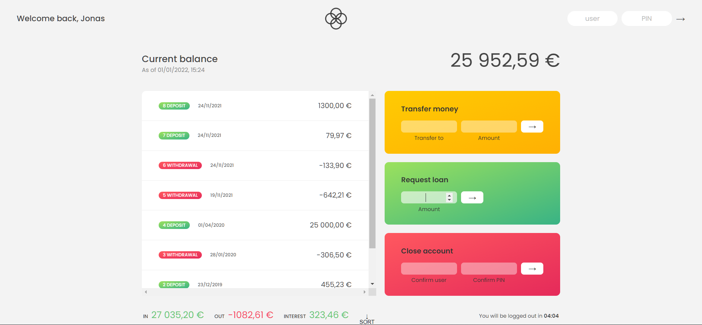

<div align="center" id="top"> 
  
</div>

<hr>
<br>

# Bankist-panel

Bankist stands for minimalist banking so this project banklist panel is a fictional bank interface.
you can view all your movements (Deposits or Withdrawals), you can see you overall balace, transfer money for other users, request a loan, or close the account.

## Quick start

Clone the Project

```bash
git clone https://github.com/Ahmedashref26/Bankist-Panel.git
```
## Usage

To use the app enter one of the two accounts
- user: aa  pin: 1111
- user: jd  pin: 2222
---

[](main.png)

## Flowchart

[](Bankist-flowchart.png)


---

## License

MIT
